# Government Jobs Portal

A comprehensive Django-based platform connecting citizens to verified employment opportunities worldwide through a transparent, government-managed recruitment system.

## Overview

The Government Jobs Portal is a secure, centralized digital platform that enables citizens to access verified job opportunities while eliminating recruitment fraud. It provides government oversight, employer verification, secure payment processing, and comprehensive application management.

## 1. Overview Diagram
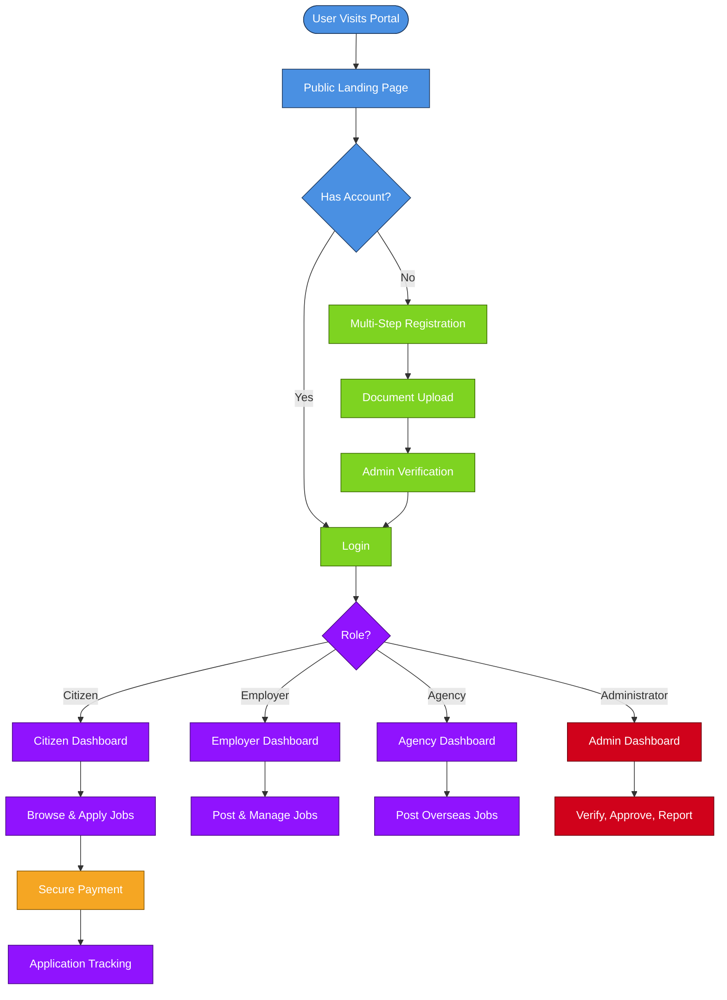
## 2. Registration, Verification & Login Flow
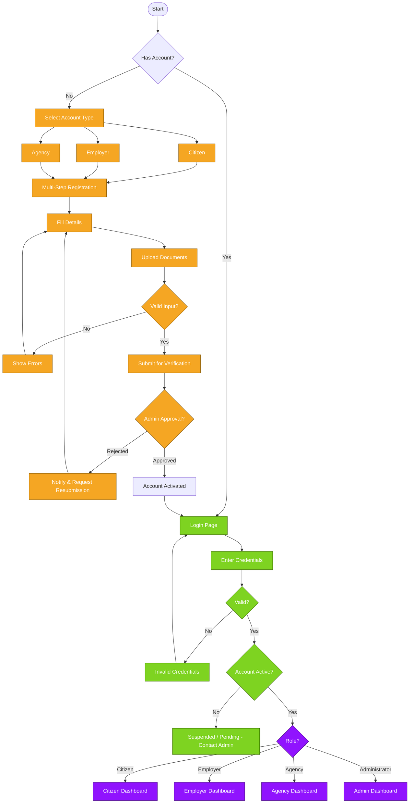
## Features

### For Citizens
- Browse verified job opportunities
- Multi-step registration with document upload
- Secure payment processing (M-Pesa, eCitizen, Bank Transfer, Visa, Mastercard)
- Personal dashboard with application tracking
- Real-time notifications
- Application status tracking (Submitted → Under Review → Shortlisted → Interview → Accepted)
  ## 3. Citizen Flow
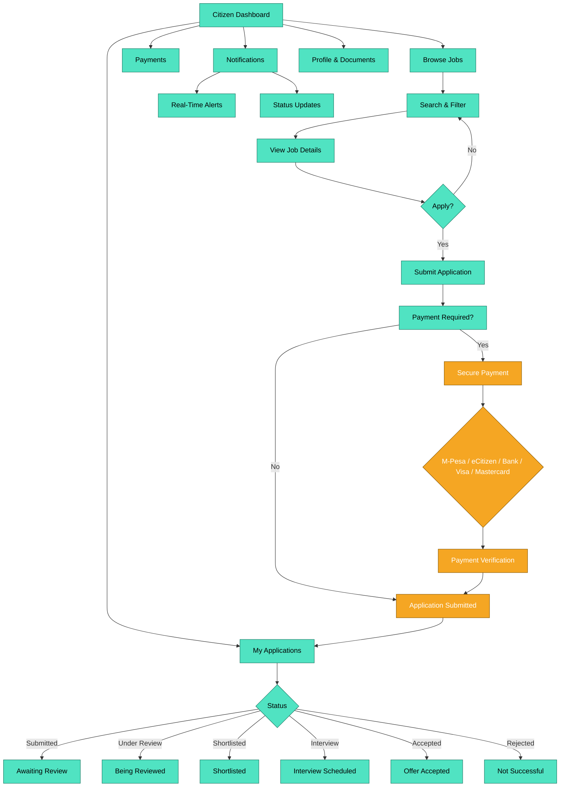

### For Employers
- Company registration and verification
- Job posting and management
- Application review and management
- CV downloads
- Candidate shortlisting and interview scheduling
## 4. Employer Flow
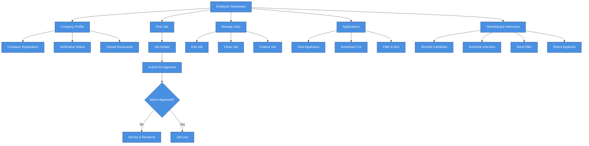

### For Recruitment Agencies
- Agency registration and accreditation
- Overseas job posting
- Applicant management
- Contract uploads
- Recruitment progress tracking
  ## 5. Recruitment Agency Flow
  ```mermaid
flowchart TD
    A[Agency Dashboard] --> B[Agency Profile]
    A --> C[Post Overseas Jobs]
    A --> D[Manage Jobs]
    A --> E[Applicant Management]
    A --> F[Contract Uploads]
    A --> G[Recruitment Progress]

    B --> B1[Agency Registration]
    B --> B2[Accreditation Status]
    B --> B3[Upload Licenses]

    C --> C1[Job Details + Country]
    C1 --> C2[Submit for Approval]
    C2 --> C3{Admin Approved?}
    C3 -- No --> C4[Revise & Resubmit]
    C3 -- Yes --> C5[Job Live]

    E --> E1[View Applicants]
    E --> E2[Shortlist]
    E --> E3[Schedule Interviews]
    E --> E4[Track Progress]

    F --> F1[Upload Contract]
    F --> F2[Attach to Candidate]

    G --> G1[Application Stages]
    G --> G2[Deployment Status]

    classDef agency fill:#9013FE,stroke:#4A0A85,color:#fff
    class A,B,C,D,E,F,G,B1,B2,B3,C1,C2,C3,C4,C5,E1,E2,E3,E4,F1,F2,G1,G2 agency
```

### For Administrators
- Comprehensive dashboard with analytics
- User management (approve, suspend, activate)
- Job management (approve, reject, feature)
- Employer and agency verification
- Payment verification and refunds
- Reports generation (CSV, Excel, PDF)
## 6. Administrator Flow
```mermaid
flowchart TD
    A[Admin Dashboard] --> B[Analytics Overview]
    A --> C[User Management]
    A --> D[Job Management]
    A --> E[Employer Verification]
    A --> F[Agency Verification]
    A --> G[Payment Verification]
    A --> H[Reports]

    C --> C1[Approve User]
    C --> C2[Suspend User]
    C --> C3[Activate User]
    C --> C4[Delete User]

    D --> D1[Approve Job]
    D --> D2[Reject Job]
    D --> D3[Feature Job]

    E --> E1[Review Company Docs]
    E --> E2[Approve / Reject Employer]

    F --> F1[Review Agency Docs]
    F --> F2[Approve / Reject Agency]
    F --> F3[Grant Accreditation]

    G --> G1[Verify Payments]
    G --> G2[Process Refunds]

    H --> H1[CSV Export]
    H --> H2[Excel Export]
    H --> H3[PDF Export]

    classDef admin fill:#D0021B,stroke:#6B000D,color:#fff
    class A,B,C,D,E,F,G,H,C1,C2,C3,C4,D1,D2,D3,E1,E2,F1,F2,F3,G1,G2,H1,H2,H3 admin
```
## 7. Application Lifecycle (Sequence)
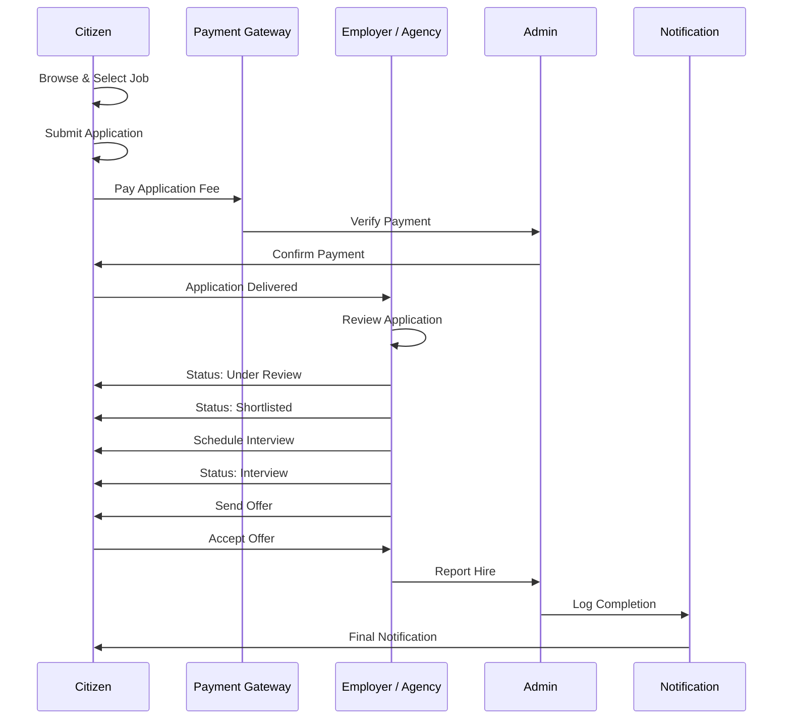
## 8. Payment Flow
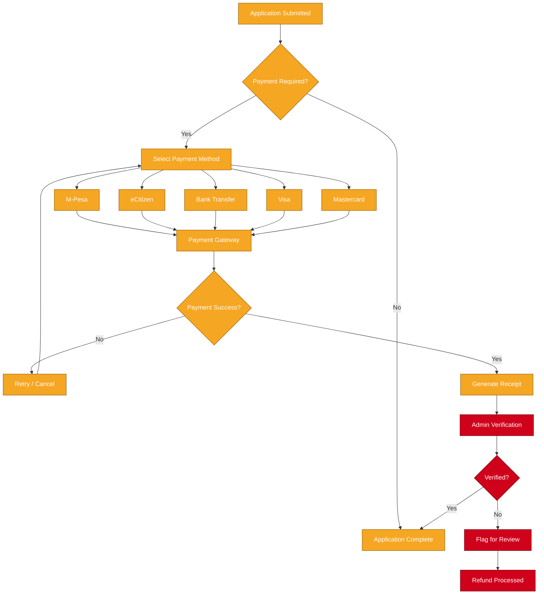
## 9. Job Posting & Approval Flow
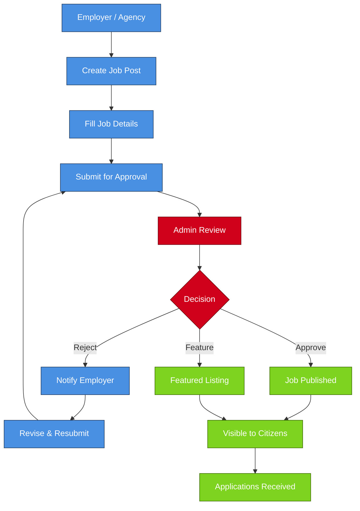
## 10. Notification Flow
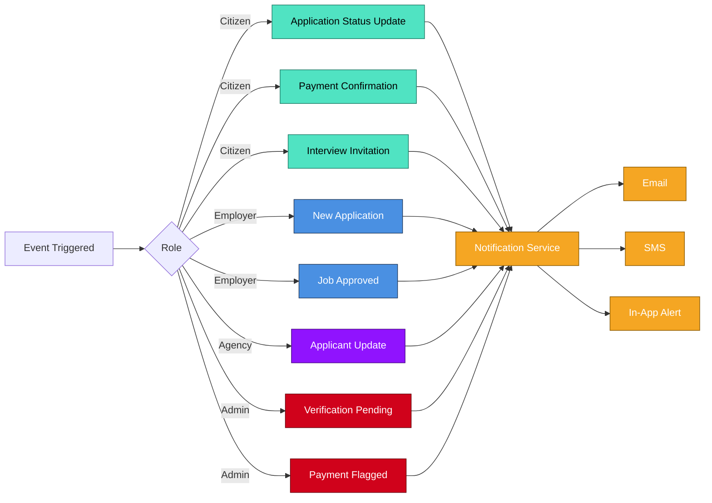
## 11. Reports & Analytics
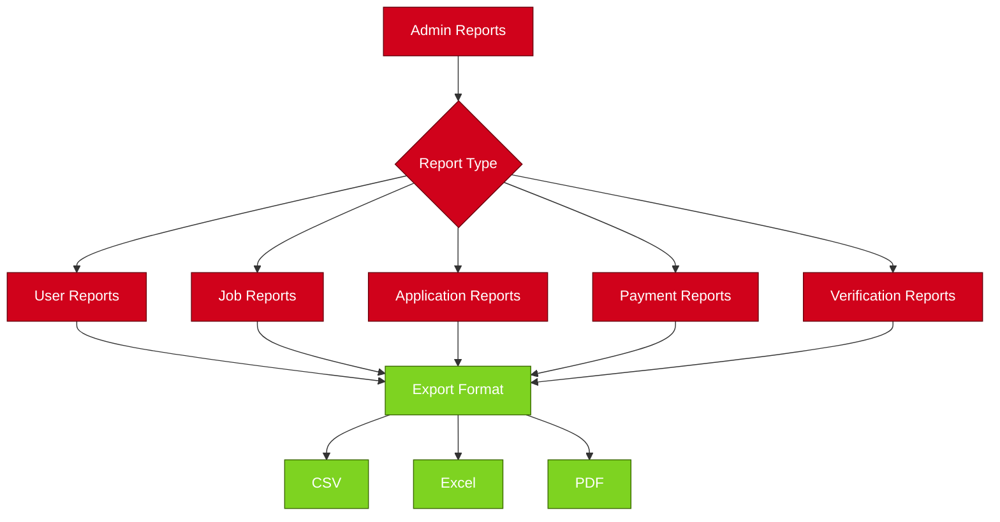
## 12. Permission Matrix
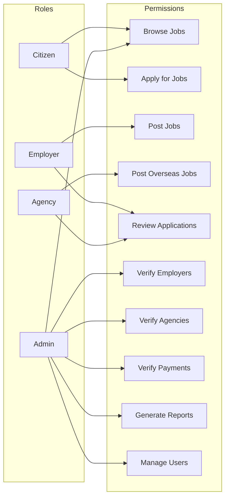

## Technology Stack

| Component | Technology |
|-----------|------------|
| Backend | Django 5.0.6 |
| Frontend | Django Templates, Tailwind CSS |
| API | Django REST Framework |
| Database | SQLite (Development) / PostgreSQL (Production) |
| Authentication | JWT, Role-Based Access Control |
| Payments | M-Pesa (Daraja API), eCitizen |
| File Storage | Local (Development) / AWS S3 (Production) |
| Notifications | Email, SMS, Dashboard |

## Prerequisites

- Python 3.10+
- pip
- virtualenv (recommended)
- Git

## Installation

### 1. Clone the Repository

git clone https://github.com/eKidenge/goverment_jobs_portal.git
cd goverment_jobs_portal
2. Create Virtual Environment
# Windows
python -m venv venv
venv\Scripts\activate

# Linux/Mac
python3 -m venv venv
source venv/bin/activate
3. Install Dependencies

pip install -r requirements.txt
4. Environment Variables
Create a .env file in the project root:

env
# Django
SECRET_KEY=your-secret-key-here
DEBUG=True
ALLOWED_HOSTS=localhost,127.0.0.1

# Database (Optional - for PostgreSQL)
# DB_NAME=gov_jobs_db
# DB_USER=postgres
# DB_PASSWORD=your-password
# DB_HOST=localhost
# DB_PORT=5432

# Email (Optional)
# EMAIL_HOST=smtp.gmail.com
# EMAIL_PORT=587
# EMAIL_HOST_USER=your-email@gmail.com
# EMAIL_HOST_PASSWORD=your-app-password
# DEFAULT_FROM_EMAIL=noreply@governmentjobs.gov

# M-Pesa (Optional)
# MPESA_CONSUMER_KEY=your-key
# MPESA_CONSUMER_SECRET=your-secret
# MPESA_PASSKEY=your-passkey
# MPESA_SHORTCODE=174379

# Site
SITE_URL=http://localhost:8000
ADMIN_EMAIL=admin@governmentjobs.gov
5. Database Setup

# Make migrations
python manage.py makemigrations accounts
python manage.py makemigrations jobs
python manage.py makemigrations payments
python manage.py makemigrations employers
python manage.py makemigrations agencies
python manage.py makemigrations notifications
python manage.py makemigrations admin_panel

# Apply migrations
python manage.py migrate

# Create superuser
python manage.py createsuperuser
6. Static Files
# Collect static files
python manage.py collectstatic

# Create media directories (if not exists)
mkdir -p media/documents/cv
mkdir -p media/documents/id
mkdir -p media/documents/passport
mkdir -p media/photos
mkdir -p media/flags
mkdir -p media/employer_logos
mkdir -p media/agency_logos
7. Run Development Server

python manage.py runserver
Access the application at: http://127.0.0.1:8000

Project Structure
text
government_jobs_portal/
├── manage.py
├── requirements.txt
├── .env
├── .gitignore
├── government_jobs_portal/
│   ├── __init__.py
│   ├── settings.py
│   ├── urls.py
│   └── wsgi.py
├── accounts/
│   ├── models.py
│   ├── views.py
│   ├── urls.py
│   ├── admin.py
│   └── forms.py
├── jobs/
│   ├── models.py
│   ├── views.py
│   ├── urls.py
│   ├── admin.py
│   └── forms.py
├── payments/
│   ├── models.py
│   ├── views.py
│   ├── urls.py
│   └── mpesa.py
├── employers/
│   ├── models.py
│   ├── views.py
│   └── urls.py
├── agencies/
│   ├── models.py
│   ├── views.py
│   └── urls.py
├── admin_panel/
│   ├── views.py
│   ├── urls.py
│   └── admin.py
├── notifications/
│   ├── models.py
│   └── views.py
├── static_pages/
│   ├── views.py
│   └── urls.py
├── templates/
│   ├── base.html
│   ├── home.html
│   ├── accounts/
│   ├── jobs/
│   ├── payments/
│   ├── dashboard/
│   └── admin_panel/
├── static/
│   ├── css/
│   ├── js/
│   └── images/
└── media/
    └── uploads/
User Types
1. Citizen
Register with personal details and documents

Browse and apply for jobs

Track applications

Make payments for job applications

2. Employer
Register company details

Post job vacancies

Manage applications

Shortlist candidates

3. Recruitment Agency
Register agency details

Post overseas jobs

Manage applicants

Upload contracts

4. Administrator
Full system access

Manage all users, jobs, and payments

Generate reports

System configuration

Payment Integration
Supported Payment Methods
M-Pesa: Integration with Daraja API

eCitizen: Government payment portal

Bank Transfer: Direct bank transfers

Visa/Mastercard: Card payments

Fee Structure
Service	Fee (KES)
Single Job Application	300
Monthly Employment Access	1,000
Quarterly Employment Access	2,500
Reports
Available report types:

Placement Statistics

Jobs by Country

Jobs by Sector

Revenue Report

Labour Migration

User Statistics

Application Statistics

Export formats: CSV, Excel, PDF

Docker Deployment
Build and Run

# Build images
docker-compose build

# Run containers
docker-compose up -d

# Run migrations
docker-compose exec web python manage.py migrate

# Create superuser
docker-compose exec web python manage.py createsuperuser

# Collect static files
docker-compose exec web python manage.py collectstatic --noinput
Docker Commands

# View logs
docker-compose logs -f web

# Stop containers
docker-compose down

# Rebuild and restart
docker-compose up -d --build
Testing

# Run all tests
python manage.py test

# Run specific app tests
python manage.py test accounts
python manage.py test jobs

# Run with coverage
pip install coverage
coverage run manage.py test
coverage report
Configuration
Settings Configuration
The project uses environment variables for configuration. Key settings:

DEBUG: Enable/disable debug mode

SECRET_KEY: Django secret key

DATABASES: Database configuration

EMAIL_BACKEND: Email configuration

MPESA_*: M-Pesa payment configuration

Production Settings
For production, update these settings in .env:

env
DEBUG=False
ALLOWED_HOSTS=your-domain.com,www.your-domain.com
SECURE_SSL_REDIRECT=True
SESSION_COOKIE_SECURE=True
CSRF_COOKIE_SECURE=True
Mobile Responsive
The portal is fully responsive and works on:

Desktop browsers

Tablets

Mobile phones

Contributing
Fork the repository

Create a feature branch

Commit your changes

Push to the branch

Create a Pull Request

Guidelines
Follow PEP 8 style guide

Write tests for new features

Update documentation

Use meaningful commit messages

License
This project is licensed under the MIT License - see the LICENSE file for details.

Contact
Website: https://governmentjobs.go.ke

Email: info@governmentjobs.go.ke

Phone: +254 20 222 0000

Address: Ministry of Labour, Nairobi, Kenya

Acknowledgments
Ministry of Labour, Kenya

Public Employment Service

Accredited Recruitment Agencies

International Employers

Foreign Embassies

Development Partners

Future Enhancements
AI-powered job matching

AI CV analysis

Mobile applications (Android & iOS)

Integration with immigration systems

Digital certificate verification

Labour market analytics dashboard

Multilingual support

Security
JWT authentication

Role-based access control

CSRF protection

SQL injection prevention

XSS protection

Secure password hashing

API Documentation
API endpoints are available at /api/ with JWT authentication.

Example API Endpoints
text
POST /api/accounts/register/ - User registration
POST /api/accounts/login/ - User login
GET  /api/jobs/ - List jobs
GET  /api/jobs/<id>/ - Job details
POST /api/jobs/<id>/apply/ - Apply for job
GET  /api/notifications/ - Get notifications
Status
The project is actively maintained and under continuous development.

Made with ❤️ by the Government of Kenya
